# Urban Block Skeleton Analysis -- A Grasshopper Plugin to evaluate street score for social distancing

___Zhenxian Huang___

___Main Contribution___
1. A set of components to compute Medial Axis Skeleton(MAS) for street block
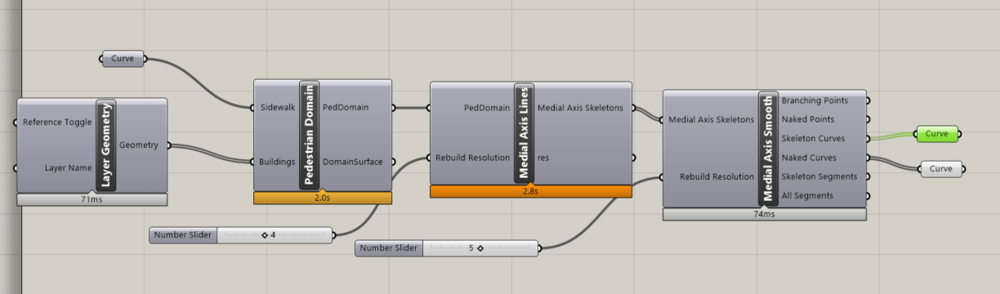
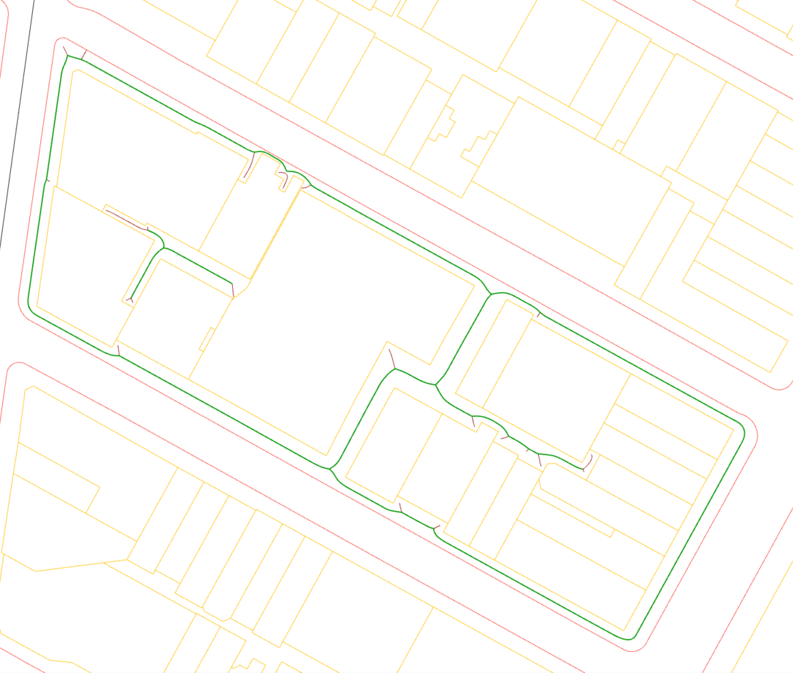

2. A set of components to simulate circle packing inside a block region
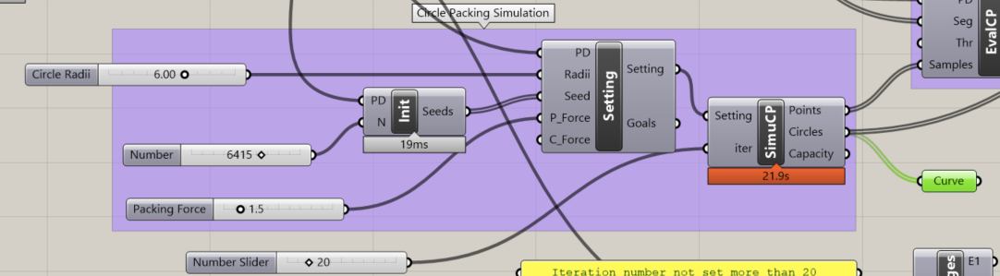
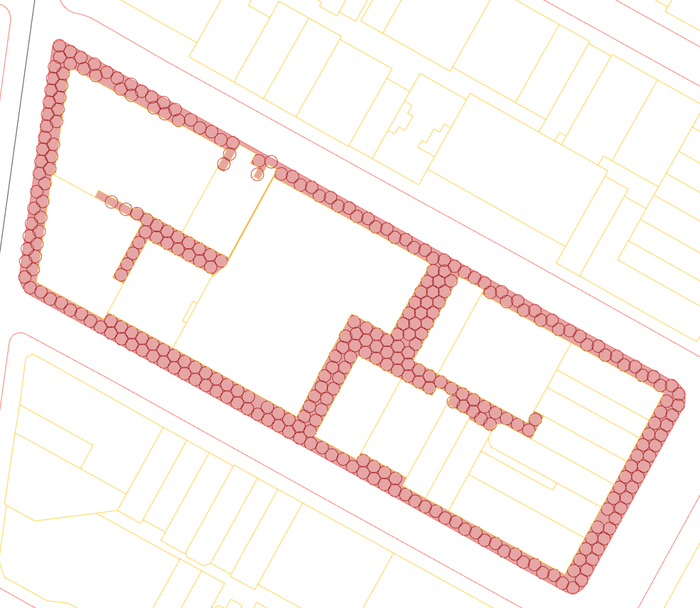

3. A set of components to evaluate how many people can pass the street at the same time based on the result of circle packing and MAS
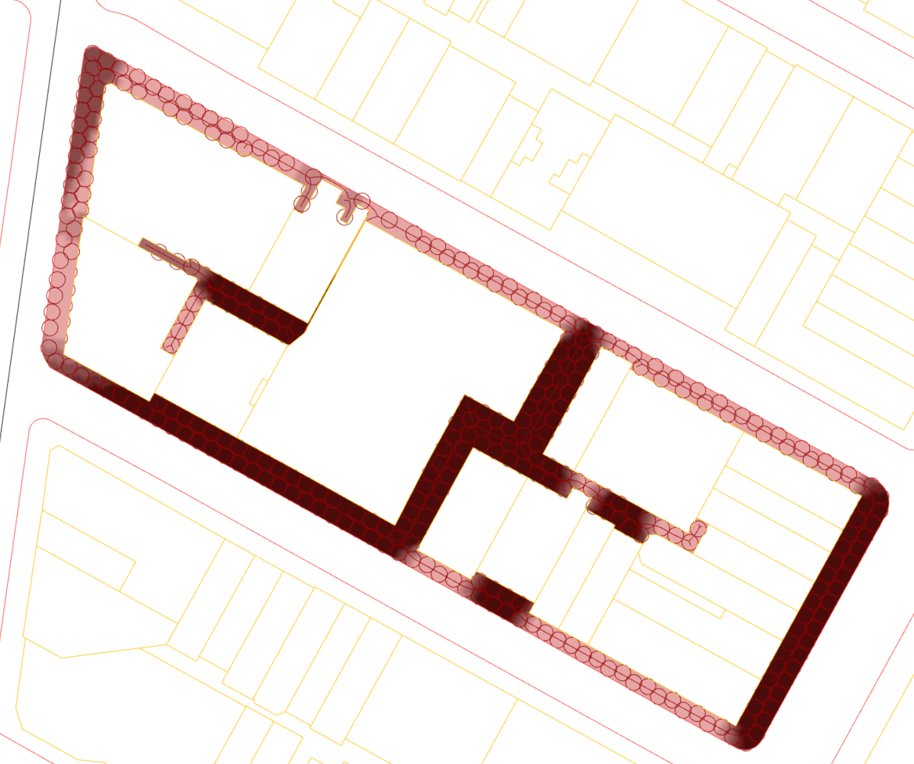

___Toolbar Layout___
1. Distance (Computes shortest distance from any point in a mesh to its boundary)
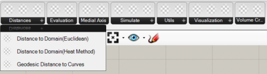

2. Evaluate (Evaluate street score based on distance calculation or circle packing result)
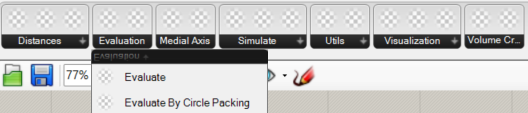

3. Medial Axis (Computes medial axis of a given mesh, user can choose whether to smoothify the result)
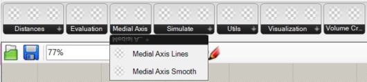

4. Simulate (Simulates the circle packing algorithm inside a mesh domain)
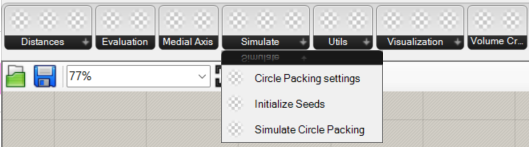

5. Visualization (Visualizes the domain mesh with color gradient based on the evaluation result)
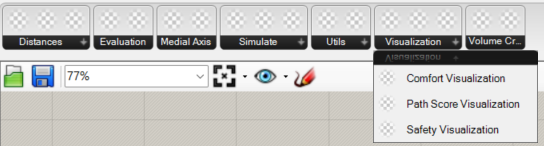

6. Utils (Utility methods to remesh and create pedestrain domain based on curve selection)
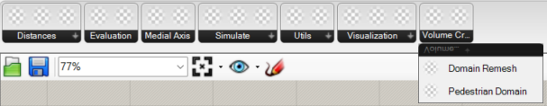

___Research Questions___

Evaluate the "width" property given domain with the topology of an outside closed loop and several inside obstacles. Analyse a scalar field on the domain based on the width property.

Naturally the "width" problem can be related to a problem of Medial Axis Transform, which gets the skeleton of geometry.Then analysis on either intersection with obstacles or number of related circle packings can be made to imply the attribute across the whole domain.

The scalar field on the domain can be seen as a problem of mapping evaluating positions to the width property of its closest skeleton segment. In order to smooth the field, we can take multiple segments and use the weighted average result.

___Tools Used___

Boolean operation on closed curves for getting the Pedestrian Domain(from clipper class wrote by Angus Johnson)

Voronoi algorithm to generate Medial Axis Skeleton(from Grasshopper.Kernel().Geometry)

Decomposition of skeletons based on degree of vertex in the graph created from skeleton(from self designed Graph class)

Width property of skeleton segments based on ray-mesh intersection(from Rhino.Geometry.Intersect)

Physical System Simulation for Circle Packing Approximation(from KangarooSolver.dll)

RTree search for final calculation of scalar field on a mesh(from Rhino.Geometry.RTree)

___WorkFlow___

1.Information Extraction:
	Extracting building footprints from layer

2.Generate Pedestrian Domain(PD)
	Use Boolean Difference between a selected boundary curve and auto-detective footprints inside the boundary to create the analysi volume.

3.Create Medial Axis Skeleton(MAS)
	Use voronoi diagram for basic MAS lines and then rebuild it based on graph connectivity. Take sample segments from original lines or rebuilt result.

4.Simulate Circle Packing
	Use physical system to process collisions of circles. The collisions will take some seeds outside of the domain and what remains is thus the result of circle packing. Maximum capacity can be informed.

5.Evaluate Segment Scores
	Use either the density of circle packing centers or the rays generated from perpendicular direction of each segment to evaluate score on each sample segment.Social distancing value(set as (6+1.7+1.7)=9.4) is an input at this stage

6.Visualize Scalar Field Analysis
	Use a good-quality mesh or directly the sample segments to visualize the result. RTree search is performed to get nearest segments for a sample point at the mesh vertex.

___Conclusions___

1.Summary

This plugin mainly takes two algorithms for evaluating a pedestrian domain: Medial Axis Skeleton for extracting path segments; and Circle Packing for generating maximum capacity. Several derived and helper functions were provided to help realize the algorithm as well as visualize the result. The final scalar field visualization gives an indication of Score distribution around the pedestrian domain. 

2.Known bugs and potential fix

---The boolean operation cannot perform correctly when there is overlap between buildings and boundary
Possible Solution: Try to extend the PedestrianDomain class to accompany for this scenario

---The smoothing operation of MAS often goes wrong because of the quality of the bad quality of initial MAS
Possible Solution: Use a different algorithm other than voronoi, i.e. Tracing Paths

---Ray intersection with Pedestrian Domain sometimes returns incorrect result. Reason still unknown so far...
Possible Solution: Not clear. Maybe write a new intersection function on ray and curves on a given plane instead of treating domain geometries as extruded mesh...

---The evaluation result can have some extremeties because of:
	1. the perpendicular direction of a MAS segment is actually along the path
	2. the physical simulation not return a full-packed result during collision
Possible Solution: Expand the search range for each analysis point on the domain and apply anti-aliasing

